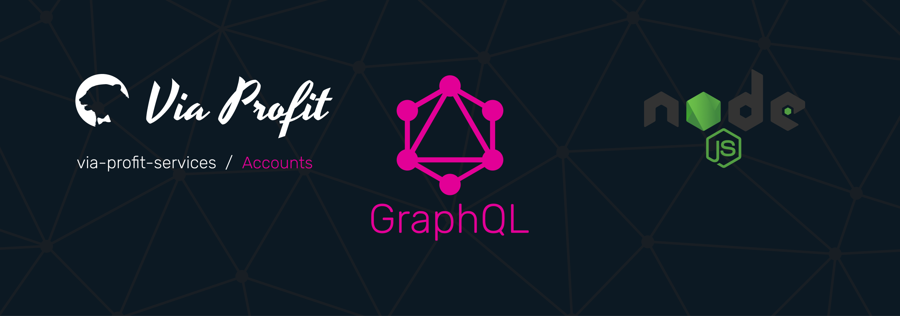

# Via Profit services / Accounts



> Via Profit services / **Accounts** - это пакет, который является частью сервиса, базирующегося на `via-profit-services` и представляет собой реализацию схемы для работы с аккаунтами пользователей.


## Содержание

- [Зависимости](#dependencies)
- [Установка и настройка](#setup)
- [Как использовать](#how-to-use)


## <a name="dependencies"></a> Зависимости

Модули, которые необходимо установить вручную

 - [Core](https://github.com/via-profit-services/core)
 - [File Storage](https://github.com/via-profit-services/file-storage)


## <a name="setup"></a> Установка и настройка

### Установка

Предполагается, что у вас уже установлен пакет [@via-profit-services/core]((https://github.com/via-profit-services/core)). Если нет, то перейдите на страницу проекта и установите модуль согласно документации.

Также необходимо установить пакет [@via-profit-services/file-storage]((https://github.com/via-profit-services/file-storage). Перейдите на страницу проекта и установите модуль согласно документации.

```bash
yarn add @via-profit-services/file-storage
yarn add @via-profit-services/accounts
```

### Миграции

После первой установки примените все необходимые миграции:

```bash
yarn via-profit-core get-migrations -m ./src/database/migrations
yarn via-profit-core knex migrate latest --knexfile ./src/utils/knexfile.ts
```

После применения миграций будут созданы все необходимые таблицы в вашей базе данных


## <a name="how-to-use"></a> Как использовать

Модуль экспортирует наружу:
 - typeDefs - Типы
 - resolvers - Резолверы
 - service - Класс, реализующий модель данного модуля

Для интеграции модуля, просто, задействуйте в своем приложении экспортируемые типы и резолверы

Пример использования:

```ts
import { App } from '@via-profit-services/core';
import { typeDefs, resolvers } from '@via-profit-services/accounts';

const app = new App({
  ...
  typeDefs,
  resolvers,
  ...
});
app.bootstrap();

```


## TODO

- [ ] Write the CONTRIBUTING docs
- [ ] Write the tests
- [ ] Create Subscriptions
